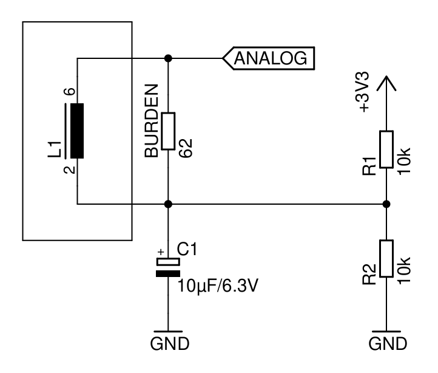
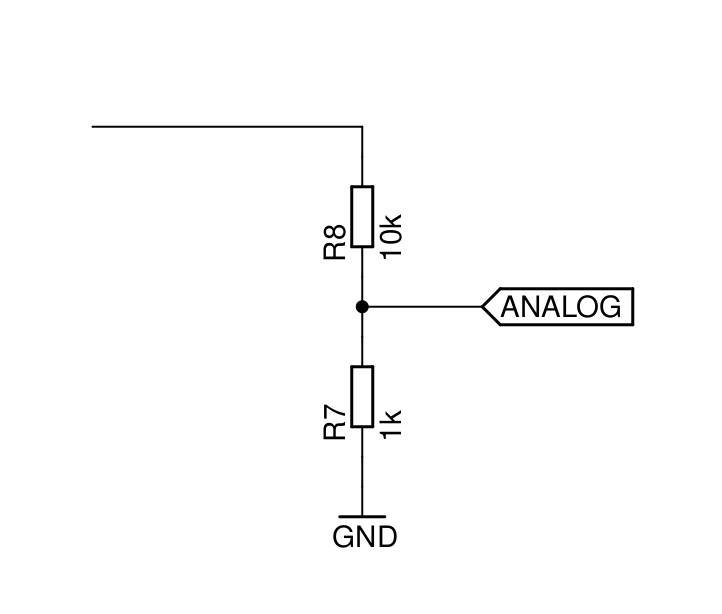
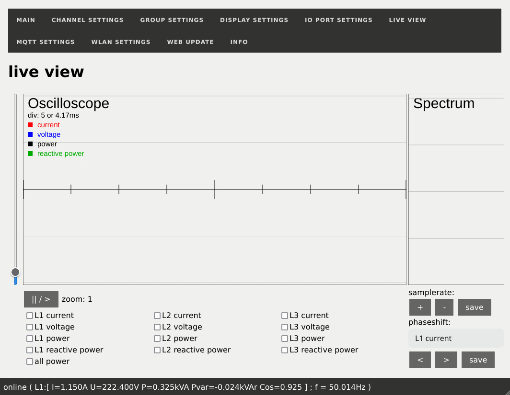
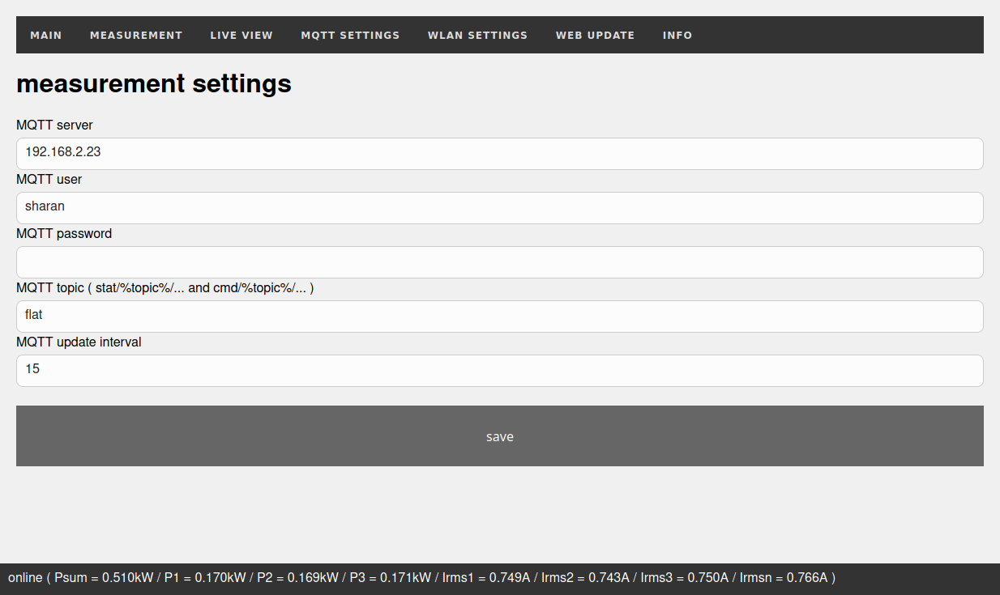
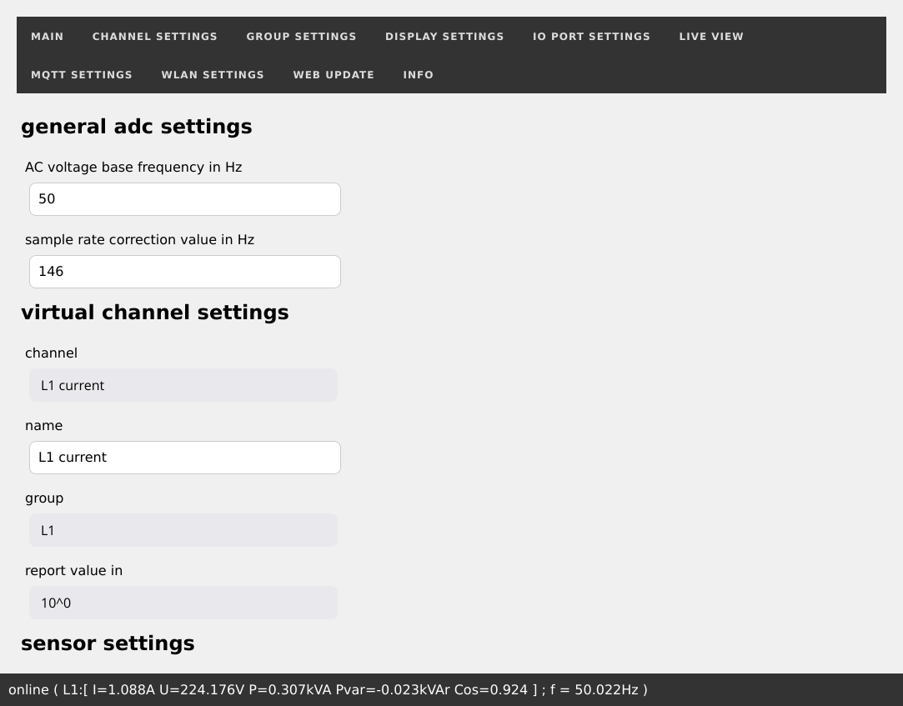

<p align="center">

&nbsp;

&nbsp;
<a href="https://www.buymeacoffee.com/sharandac" target="_blank"></a>
</p>
<hr/>

# powermeter

A simple smartmeter based on ESP32. Supports the complete setup via web interface, MQTT and live monitoring via web interface.

# Install

Clone this repository and open it with platformIO. Remember, the SPIFF must also be flashed. On a terminal in vscode you can do it with
```bash
pio run -t uploadfs
pio run -t upload
```

After that, take a look at your monitorport ...

```text
Read config from SPIFFS
scan for SSID "" ... not found
starting Wifi-AP with SSID "powermeter_aadee0"
AP IP address: 192.168.4.1
Start Main Task on Core: 1
Start NTP Task on Core: 1
Start Measurement Task on Core: 0
Start MQTT-Client on Core: 1
Start Webserver on Core: 1
NTP-client: renew time
Start OTA Task on Core: 1
Failed to obtain time
NTP-client: Thursday, January 01 1970 01:00:07
```
When the output look like this, congratulation!

After the first start an access point will be opened with an unique name like
```bash
powermeter_XXXXX
```
and an not so unique password
```bash
powermeter
```
After that you can configure the powermeter under the following IP-address with your favorite webbrowser
```bash
http://192.168.4.1 or powermeter_xxxxxx.local
```
# How it works


# Hardware

SCT013-000 curretn sensor (~100A)

ZMPT101B voltage sensor (~250V)

ACS712 current sensor 5A, 20A and 30A

simple voltage divider


For ratio calculation see inline documentation via webinterface.

# Channel setting

At any time, all 6 adc channel are read in simultaneously regardless of the settings. Afterwards, these 6 ADC channels are distributed to 13 virtual channels with the help of microopcode, each sample has a maximum of 10 opcodes available for real-time calculations (mixing, sum calculation, reactive power and so on). These 13 virtual channels can then be combined into a maximum of 6 output groups. For more information about how three-phase current and power calculations works, [read here](https://en.wikipedia.org/wiki/Three-phase_electric_power)!

# Interface

## live view

## MQTT settings

## measurement settings


# Contributors

Every Contribution to this repository is highly welcome! Don't fear to create pull requests which enhance or fix the project, you are going to help everybody.
<p>
If you want to donate to the author then you can buy me a coffee.
<br/><br/>
<a href="https://www.buymeacoffee.com/sharandac" target="_blank"></a>
</p>
