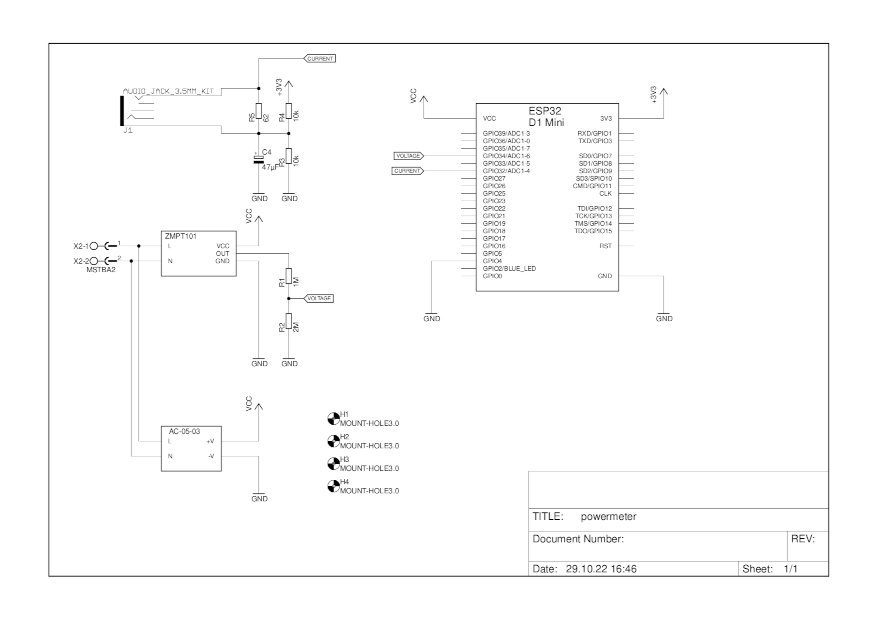
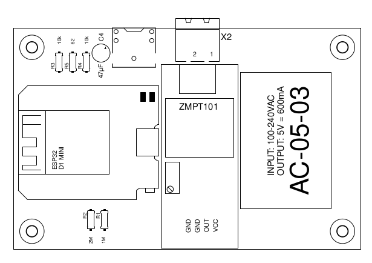
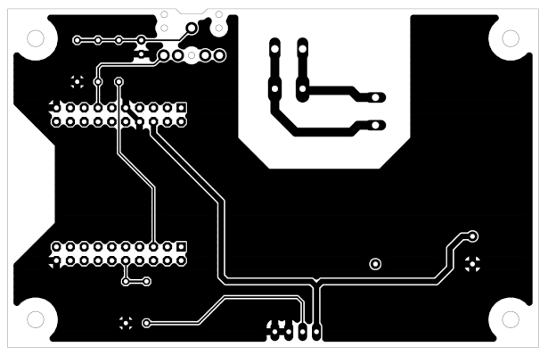
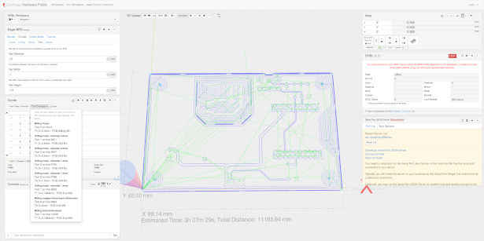
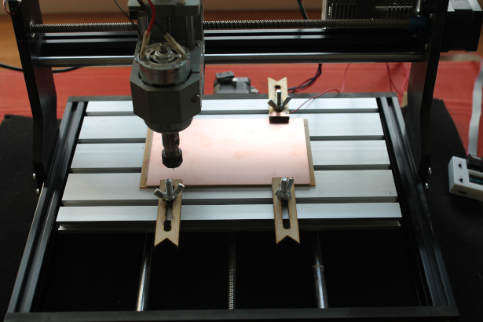
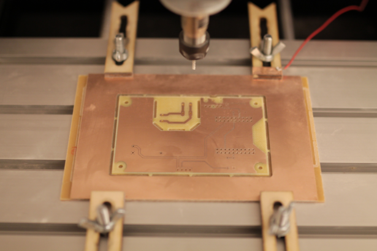

# powermeter with supply

Here is the simplest standalone powermeter with supply you can build with current and voltage measurement.

## eagle files

[schematic](powermeter.sch) 
[board](powermeter.brd)

## bill of material

1 x 150x100x1mm 35µm FR4 [amazon](https://amzn.eu/d/hufknsN) 
esp32 D1 mini [amazon](https://amzn.eu/d/gZaocqF) 
ZMPT101 [amazon](https://amzn.eu/d/3shv3Ax) 
SCT-013-000 [amazon](https://amzn.eu/d/5wpwDs4) 
AC-05-03 ( 110-250V/AC -> 5V/DC ) [amazon](https://amzn.eu/d/ckoURve) 
3.5mm jack [amazon](https://amzn.eu/d/a7YUG0G) 
MSTBA2 connector [amazon](https://amzn.eu/d/0bCERTn) 
2 x 10k resistor 
1 x 62R resistor 
1 x 1M resistor 
1 x 2M resistor 
1 x 47µF cap 

## gcode

The G-code files are intended for Chilipeppr with a CNC3018 and contain everything. Engraving, drilling and cutting. There are two files. A normal one, where you should have your own gcode for tool change and length measurement and one with the appropriate gcode that also contains the length measurement. The reference point is X=0 and Y=0.

A backlash-free Z-axis is very important for accurate engraving of the tracks and cutting out!

The following tools are required:

0.1mm milling bit 
0.6mm drill bit 
0.9mm drill bit 
1.2mm drill bit 
1.3mm drill bit 
1.4mm drill bit 
2.0mm end mill 

Drag and drop the preferred gcode file into Chilipeppr. Autoleveling is a must. And then just press play. For the tool change, the program is paused at the appropriate position (M6).

If everything has gone well, you are rewarded with a finished board without any post-processing and is ready to soldering.

## config

After soldering and software installtion (wifi,mqtt and so on) you can copy the content from config/measure.json to your powermeter. From here you can tweake the ratio settings for precise measuring via web interface under "channel settings".